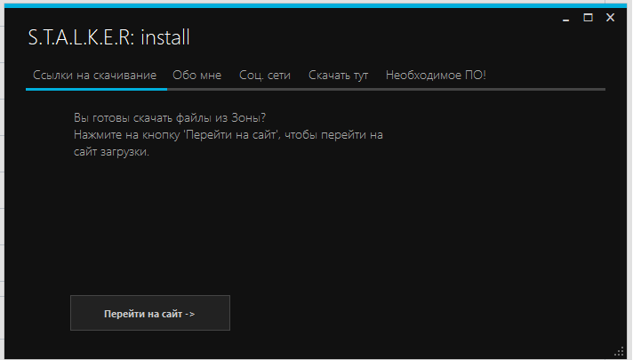
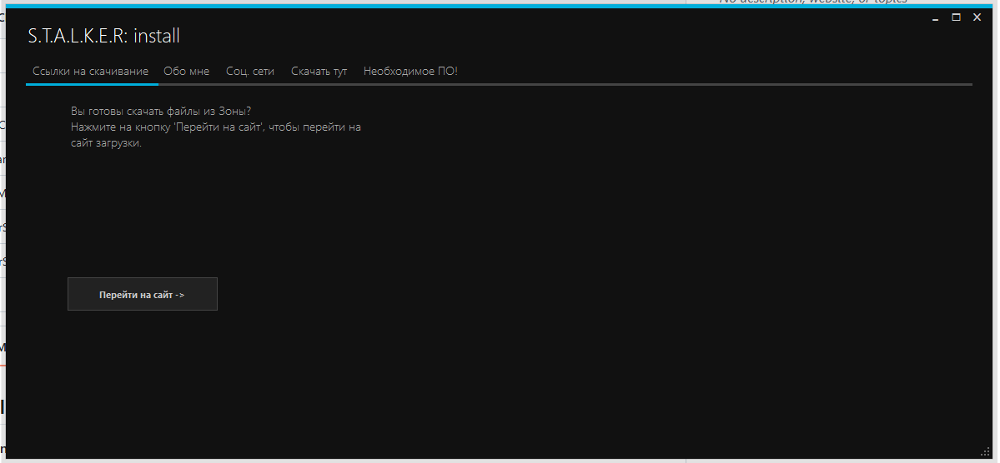
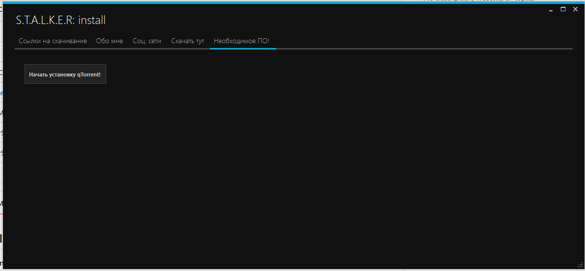
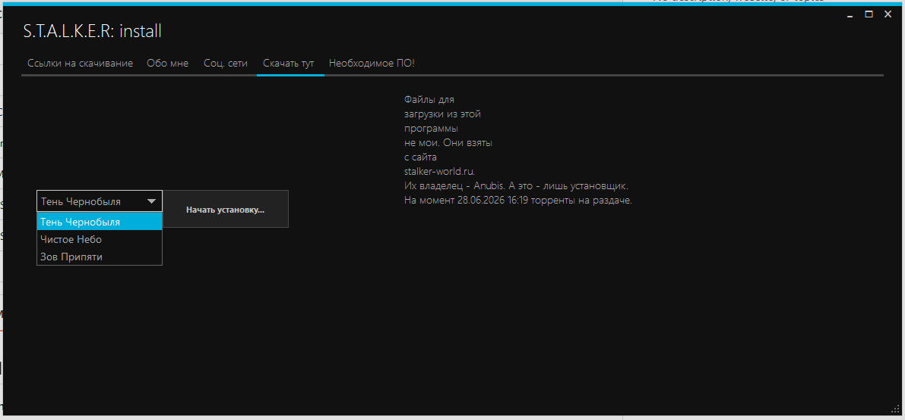
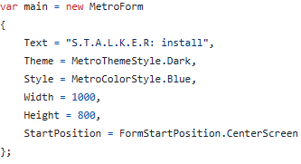

## ⚠️ Important Note / Warning

* **Language info:** Please note that the entire project written in **Russian**. 
* **For Russian users:** Если вы плохо понимаете английский интерфейс GitHub, рекомендуется включить автопереводчик в браузере (Google Translate / Яндекс Переводчик), чтобы вам было проще ориентироваться на этой странице.

---

## 🖥️ Window Size Recommendations

* **If you downloaded the ready-to-run app from Releases:**
  For the best visual experience and to see all elements clearly, it is highly recommended to **maximize the window** or resize it larger right after opening.

* **If you are building (compiling) the source code yourself:**
  If you are running the project from source, it is recommended to set a larger default window size in the **`var main`** variable inside the code before launching.

---

## 📸 Interface & How to Use

When you launch the application, you will be greeted by the main menu:

> 💡 **Recommendation:** It is highly recommended to maximize or expand the window to see all elements clearly, as shown below:

### 🛠 Selecting Software & Games

* **Required Software:** Open the **"Необходимое ПО"** (Required Software) tab if you don't have uTorrent installed yet:
  

* **Game Selection:** You can easily choose and install any of the three parts of the iconic S.T.A.L.K.E.R. trilogy:
  

---

## 💻 For Developers

If you are building (compiling) the source code yourself and want to customize the interface, you can easily change the **window size, background color, or header text**. 

All of these settings can be modified within the specific code block shown in the screenshot below:

---
